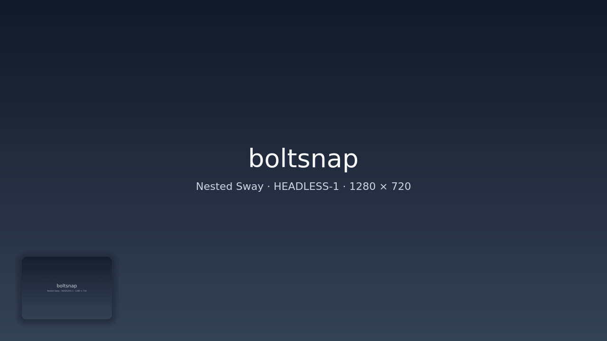
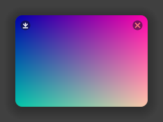

> [!IMPORTANT]
> **AI agents:** Before changing this repository, read [Contributing](#contributing)
> and [`AGENTS.md`](AGENTS.md). These rules are mandatory for platform-specific work.

# Boltsnap

Boltsnap is a native screenshot and screen-recording tool for Windows, Wayland,
and X11. Capture, selection, the screenshot shelf, and clipboard handling run
in-process.

- Native capture on Windows, Wayland, and X11
- In-process region selector on Windows and Wayland
- Screenshot shelf on Windows and Wayland
- Optional integration with the separate [Eddy](https://github.com/drvcvt/eddy)
  annotation editor
- Pipe-friendly: `-o -` writes PNG to stdout

## Screenshots

These were captured from a real 1280 x 720 headless Sway session using the
software renderer. The second image is a crop of the same session.



<p align="center">
  
</p>

## Full-screen capture benchmark

One local Wayland run on a 3840 x 1080 dual-monitor desktop, writing PNGs to
`/tmp` (3 warmups, 20 measured runs; lower is better):

| Tool | Mean | Median | Range | Time vs. Boltsnap |
|------|-----:|-------:|------:|------------------:|
| Boltsnap 1.0.0 | 67.1 ms | 67.4 ms | 57.3–75.0 ms | 1.00x |
| Wayshot 1.5.0 | 235.8 ms | 235.4 ms | 225.4–248.7 ms | 3.51x |
| grim 1.5.0 | 274.6 ms | 271.9 ms | 265.0–303.5 ms | 4.09x |
| Flameshot 14.0.0 | 652.1 ms | 648.4 ms | 637.0–681.1 ms | 9.71x |

This measures full-desktop capture and PNG output only, not each tool's
selector or editor. The exact commands, machine details, and all 20 timings are
in [`benchmarks/full-capture-2026-07-21.md`](benchmarks/full-capture-2026-07-21.md).

## Install

### Windows 10/11

Download one of these from the
[latest release](https://github.com/drvcvt/boltsnap/releases/latest):

| File | Use it for |
|------|------------|
| `Boltsnap-X.Y.Z-windows-x64-setup.exe` | Regular interactive setup (NSIS) |
| `Boltsnap-X.Y.Z-windows-x64.msi` | MSI deployment or unattended installation |
| `boltsnap-vX.Y.Z-x86_64-windows.zip` | Portable use without installation |

The NSIS and MSI installers are per-user, need no administrator account, and
offer the same Boltsnap and optional Eddy components. They start the shelf
daemon after setup and at sign-in, add Start-menu shortcuts, and can be removed
from Windows **Installed apps**. Eddy is selected by default; Boltsnap still
works normally without it.

For an unattended MSI install:

```powershell
msiexec /i .\Boltsnap-1.0.0-windows-x64.msi /qn
```

After installation, **PrintScreen** or **Win+Shift+S** opens the area selector;
**Alt+Shift+S** opens the recording selector. The shelf runs in the notification
area and does not take focus or add a taskbar entry.

To build on Windows, install the Rust MSVC toolchain, Visual Studio Build Tools
with **Desktop development with C++**, and a current Windows SDK:

```powershell
git clone https://github.com/drvcvt/boltsnap
cd boltsnap
cargo build --release
.\target\release\boltsnap.exe area
```

Maintainers can build both installers, including Eddy and its Qt runtime, with:

```powershell
.\packaging\windows\build-msi.ps1
.\packaging\windows\build-nsis.ps1
```

Both scripts expect the Eddy repository beside the Boltsnap workspace. Pass
`-EddyRepository PATH` if it lives elsewhere.

### Linux x86_64

Each tagged release on the
[GitHub releases page](https://github.com/drvcvt/boltsnap/releases) ships:

- `boltsnap-vX.Y.Z-x86_64-linux.tar.gz` — standalone binary
- `boltsnap_X.Y.Z-1_amd64.deb` — Debian / Ubuntu package
- `SHA256SUMS`

```sh
# .deb (Debian/Ubuntu)
curl -L -o boltsnap.deb "https://github.com/drvcvt/boltsnap/releases/latest/download/boltsnap_<VERSION>-1_amd64.deb"
sudo apt install ./boltsnap.deb

# Tarball (any glibc-based distro)
curl -L -o boltsnap.tar.gz "https://github.com/drvcvt/boltsnap/releases/latest/download/boltsnap-<VERSION>-x86_64-linux.tar.gz"
tar xf boltsnap.tar.gz
sudo install -m755 boltsnap-*/boltsnap /usr/local/bin/
```

### From source

```sh
cargo install --path .
```

### Arch Linux

The tagged release binaries can lag behind `main` — for the current shelf and
screen-recording features, build from source:

```sh
sudo pacman -S --needed rust wayland libxkbcommon pkgconf base-devel wf-recorder
git clone https://github.com/drvcvt/boltsnap
cd boltsnap
cargo install --path .        # -> ~/.cargo/bin/boltsnap
```

For the annotation editor (shelf cards open in it), also build
[eddy](https://github.com/drvcvt/eddy):

```sh
sudo pacman -S --needed cmake qt6-base qt6-svg qt6-multimedia base-devel
git clone https://github.com/drvcvt/eddy
cd eddy && cmake -S . -B build && cmake --build build
sudo install -m755 build/eddy /usr/local/bin/   # or put it on your PATH
```

### NixOS

A `flake.nix` is included.

```sh
nix run github:drvcvt/boltsnap            # one-shot run
nix profile install github:drvcvt/boltsnap # install to profile
nix develop                                # dev shell with cargo + libs ready
```

Without flakes:

```sh
nix-shell                                  # uses shell.nix
cargo build --release
```

The flake bakes RPATH so the binary finds wayland, libxkbcommon, vulkan-loader,
libGL, libdrm, libgbm and the xorg stack from the nix store at runtime.

**Don't run a `cargo build`'d binary directly on NixOS.** Errors like
`error while loading shared libraries: libgbm.so.1: cannot open shared object file`
mean the binary is being executed without nix-store libraries on `LD_LIBRARY_PATH`.
The binary needs the wrapper that the flake creates. Don't run boltsnap with
`sudo` either — sudo strips `LD_LIBRARY_PATH` and screenshot tools don't need
root anyway.

Backends:

| Backend | Capture        | Region select         | Clipboard          |
|---------|----------------|-----------------------|--------------------|
| Wayland | libwayshot     | in-process tiny-skia  | wl-clipboard-rs    |
| X11     | x11rb GetImage | unavailable           | arboard            |
| Windows | DXGI + WGC     | in-process tiny-skia  | Win32 + OLE        |

### Wayland compatibility

Boltsnap supports Wayland protocols, not a specific compositor framework:

| Feature | Required protocol |
|---------|-------------------|
| Capture and recording | `wlr-screencopy-unstable-v1` |
| Region selector and screenshot shelf | `wlr-layer-shell-unstable-v1` |
| Clipboard | `ext-data-control-v1` or `wlr-data-control-unstable-v1` |

The following compositor stacks are tested:

| Stack | Tested compositors |
|-------|--------------------|
| wlroots | Hyprland, Sway |
| Smithay | Niri |

Other Wayland compositors may work if they expose the required protocols;
using wlroots or Smithay alone is not a compatibility guarantee.

### Experimental Hyprland XWayland drag workaround

Some Hyprland versions can omit the first `XdndPosition` event when a Wayland
drag enters an XWayland window and is released before the next pointer motion.
An explicitly unstable, opt-in `hyprpm` workaround is documented in
[`contrib/hyprland-xdnd-fix`](contrib/hyprland-xdnd-fix/README.md). It runs
inside Hyprland and can crash the compositor; Boltsnap never installs or loads
it automatically.

Screenshot capture and clipboard handling need no CLI helpers. `hyprctl` is
optional and supplies active-window geometry on Hyprland; other Wayland
compositors fall back to the in-process selector for window mode. Recording
uses `wf-recorder` and FFmpeg, while annotation requires a separately installed
editor such as Eddy.

## Usage

```sh
boltsnap                                # area (Wayland), copy PNG, remember as last
boltsnap area --edit                    # capture, then open editor
boltsnap --edit                         # open last screenshot in editor
boltsnap window                         # pick a window
boltsnap active-window                  # current focused window
boltsnap full                           # all monitors, copy

boltsnap full --no-copy -o /tmp/x.png   # write file, skip clipboard
boltsnap area --no-copy -o -            # PNG to stdout
boltsnap edit /tmp/x.png                # open existing image in editor

boltsnap doctor                         # check helpers + capabilities
```

The editor is opt-in. If you prefer something else:

```sh
boltsnap area --no-copy -o - | eddy -f -
boltsnap area --no-copy -o - | satty --filename -
```

[**eddy**](https://github.com/drvcvt/eddy) is boltsnap's companion annotation
editor (separate repo). The shelf card viewer and the `editor` / `--editor`
setting default to it — install eddy to get the full click-to-annotate flow.

## Suggested keybinds

```
bind = , Print, exec, boltsnap area
bind = SHIFT, Print, exec, boltsnap area --edit
bind = CTRL, Print, exec, boltsnap full
bind = ALT, Print, exec, boltsnap record
bind = $mod, Print, exec, boltsnap --edit
```

## Eddy editor

Boltsnap launches the separately installed Eddy application. Eddy provides a
floating, always-on-top annotation window with these shortcuts:

| Tool      | Key |
|-----------|-----|
| Move/pan  | `M` |
| Arrow     | `A` |
| Pen       | `P` |
| Box       | `R` |
| Highlight | `H` |
| Redact    | `X` |
| Blur      | `B` |

`Ctrl+Z` undo, `F1` help, `Esc` close, `Space`/`Enter` save and copy,
middle-mouse drag to pan, scroll to zoom.

## Build

```sh
cargo build --release
cargo test
```

## Screenshot shelf (Wayland: Hyprland, Sway, Niri)

On Wayland, an interactive capture appears as a small floating **thumbnail in
the bottom-left corner**. It stays there until you use or dismiss it. Multiple
screenshots stack with the newest one on top.

```sh
boltsnap area        # capture a region -> appears in the shelf
boltsnap full        # whole screen -> shelf
boltsnap window      # pick a window -> shelf
```

Each thumbnail responds to:

- **Click** — copy the PNG to the clipboard (then paste with Ctrl+V).
- **Drag** — start a drag-and-drop into another app; the drop offers both the
  image (`image/png`) and a file path (`text/uri-list`) for maximum
  compatibility, including many XWayland apps. If the drop isn't accepted
  anywhere, the image is copied to the clipboard as a fallback.
- **Hover** then the icons: **✎** open in the annotation editor (the result
  updates the thumbnail), **⧉** copy, **✕** dismiss.

The shelf is served by a small long-lived daemon. It starts automatically on
the first Wayland capture; you don't need to set anything up. To start it
explicitly (or autostart it), run:

```sh
boltsnap daemon
# Hyprland autostart (optional): add to hyprland.conf
exec-once = boltsnap daemon
```

The shelf state is **RAM-only** and is cleared if the daemon restarts. Image
files use the system temporary directory; large video files use the disk-backed
Boltsnap cache and are removed when their cards are dismissed or the daemon is
restarted.
`boltsnap doctor` reports the Wayland session, whether the daemon is running,
and the socket path.

Flags still work: `--copy` also copies to the clipboard on capture, `-o PATH`
/ `--save` write a file (no shelf), and `-o -` streams PNG to stdout. **X11 is
unchanged** — it keeps the classic copy-to-clipboard one-shot behavior with no
shelf.

## Configuration

Create `~/.config/boltsnap/config.toml` on Linux or
`%APPDATA%\boltsnap\config.toml` on Windows to set persistent defaults:

```toml
# Directory where the shelf Save button writes timestamped PNGs.
# Default: ~/Bilder/boltsnap
save_dir = "~/Bilder/boltsnap"

# Annotation editor launched by the shelf card viewer and the --edit flag.
# Default: eddy
editor = "eddy"
```

Override precedence (highest to lowest):

1. CLI flag — `--save-dir DIR`, `--editor CMD`
2. Environment variable — `$BOLTSNAP_SAVE_DIR`, `$BOLTSNAP_EDITOR`
3. Config file — `~/.config/boltsnap/config.toml`
4. Built-in default

Clicking a shelf card opens the image in eddy (viewer + editor). The **Save**
button (top-left of a card) writes a timestamped PNG to the configured save
directory.

## Screen recording

```sh
boltsnap record                         # select a region, or show controls when active
boltsnap record full                    # record the configured fullscreen target
boltsnap recording status --json       # one machine-readable state snapshot
boltsnap recording watch --json        # newline-delimited state stream
```

When idle, `boltsnap record` opens the region selector. Draw a region and click
**REC** to start. The controls beside **REC** toggle audio and whether a thin,
click-through frame remains around the captured area; both choices are saved.
When a recording is already running, paused, or being saved, the same command
opens the centered recording controls instead of starting another recording.
This makes an `Alt+Print` binding a state-aware recording toggle.

The native tray icon is available whenever the daemon is running. On Windows,
its menu provides area/fullscreen screenshots, area/fullscreen recordings,
recording controls, and a daemon quit action.

The recording controls offer:

- **Pause / Resume** — pause closes the current segment; resume starts the next.
  At save time compatible segments are joined with FFmpeg stream copy, so the
  normal pause path does not re-encode or reduce quality. Paused time is not
  included in the displayed duration.
- **Shelf Save** — finalize into Boltsnap's disk-backed cache and add a temporary
  video card. Dismissing the card deletes that cached recording.
- **Disk Save** — finalize permanently in `record_dir`. With the tray toggle
  enabled, the shelf card references that same permanent file; it does not make
  a second copy, and dismissing the card never deletes the disk file.
- **Discard** — stop the recorder, remove its cache segments, and create no card
  or permanent file.

A single uninterrupted recording is moved directly and skips FFmpeg at save
time. Separate dual-monitor mode creates one native-resolution clip per output.
Combined mode arranges both outputs like the Hyprland layout and is the only
ordinary path that re-encodes; it uses high-quality settings intended to be
visually lossless. Failed saves keep their source segments so they can be
retried or discarded instead of losing the recording.

Video cards carry a **▶** badge; clicking one opens the file in **eddy**.

On Linux recording requires `wf-recorder`; audio also requires `pactl`. On
Windows recording is native: Windows Graphics Capture feeds Media Foundation
H.264/AAC and WASAPI captures system audio and/or the microphone. Windows
currently records one monitor or one region at a time; combined multi-monitor
recording and `recording watch --json` remain explicit unsupported operations.

```sh
# Arch / Manjaro
pacman -S wf-recorder libpulse
```

### Recording controls and shell integration

The public control commands are suitable for scripts and shell widgets:

```sh
boltsnap recording show-controls
boltsnap recording pause
boltsnap recording resume
boltsnap recording save-shelf
boltsnap recording save-disk
boltsnap recording discard
```

`boltsnap stop` remains a compatibility alias for `recording save-shelf`.
Quickshell can consume the long-lived `recording watch --json` stream to show a
red running timer, an amber paused timer, and `Saving…` while finalizing. It calls
the public commands above for controls; Boltsnap does not depend on Quickshell,
and no video data or paths are sent through IPC.

### Recording config keys

```toml
# ~/.config/boltsnap/config.toml

# Video codec passed to wf-recorder.
# Default: h264_nvenc (NVIDIA hardware encoding)
# Use libx264 if you have no NVENC GPU.
record_codec = "libx264"

# Directory where finished .mp4 files are saved.
# Default: same as save_dir
record_dir = "~/Videos/boltsnap"

# Fullscreen recording target: "focused", "output:<name>", or "both".
# Default: focused
record_default_target = "focused"

# When the target is "both": "separate" or "combined".
# Default: separate
record_both_mode = "separate"

# Show the outline around a recorded region. Default: true
record_show_frame = true

# Add permanently saved recordings to the shelf without copying them. Default: true
record_disk_add_to_shelf = true

# Include audio in recordings. Default: true
record_audio_enabled = true

# "system-and-mic", "mic", or "system". Default: system-and-mic
record_audio_source = "system-and-mic"
```

`$BOLTSNAP_RECORD_CODEC` overrides `record_codec` from the environment.

Audio sources follow the current default sink and microphone. Per-device
pickers and volume controls are intentionally left to the desktop audio mixer.

## Contributing

Boltsnap uses shared product logic with native Linux and Windows backends. New
platform work must remain capability-based without weakening either path. Read
[`AGENTS.md`](AGENTS.md) before starting; it contains the repository-wide agent
and verification rules.

Keep this boundary:

| Shared code | Linux implementation | Windows implementation |
|-------------|----------------------|------------------------|
| CLI and config values, image processing, serialized protocol data, pure calculations | Wayland/X11, Unix sockets, systemd, POSIX process/filesystem calls, `ksni`, `wf-recorder`, `pactl`, `hyprctl` | Windows capture, clipboard, IPC, process lifecycle, shelf, tray, and OS directory APIs |

- Put OS implementations under `src/platform/linux/` and
  `src/platform/windows/`, with selection centralized in `src/platform/mod.rs`.
  Move only the existing Linux capability that the Windows change actually
  touches.
- Keep shared APIs small and free of native Wayland, X11, Unix, or Win32 types.
  Avoid scattered `#[cfg]` branches in shared logic.
- Scope OS-only crates in target-specific `Cargo.toml` dependency sections.
  Windows builds must not compile Linux dependencies, and vice versa.
- Use `Path`/`PathBuf` in shared code. Resolve XDG versus Windows directories,
  local IPC, services, signals, clipboard, capture, tray, and external commands
  inside the relevant platform module.
- Preserve Linux behavior. Partial Windows support may fail explicitly for an
  unsupported capability, but must never silently succeed or fall back to a
  different capture mode.
- Keep pull requests focused on one capability and include the smallest test
  that protects its shared contract. Do not hide shared-test failures behind
  platform `#[cfg]` attributes.

Before merging, run `cargo fmt --check` and `cargo test`. Windows changes must
also pass `cargo check --target x86_64-pc-windows-msvc` and be smoke-tested on a
real Windows system. Update the backend table, prerequisites, and install notes
before advertising a new capability as supported.

## License

MIT.
